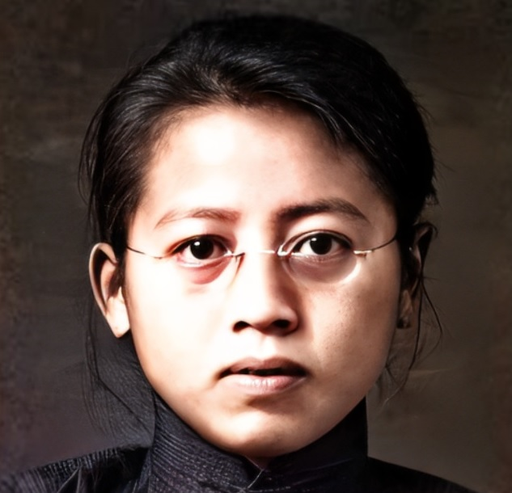
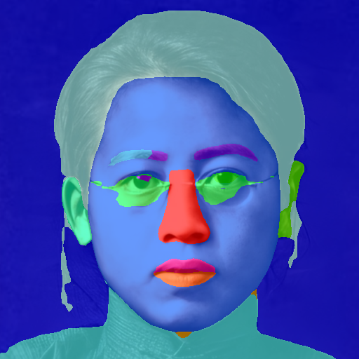
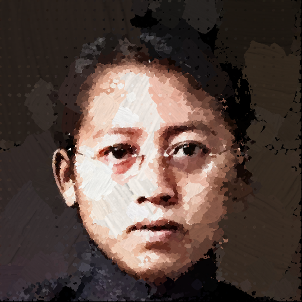
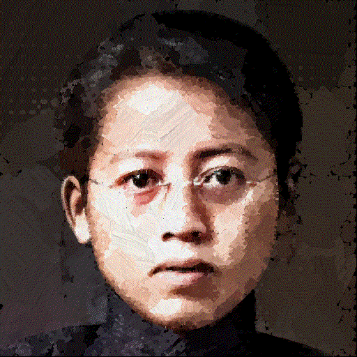

# Face Painter

**Face Painter** simulates the process of painter painting portrait oil painting. Instead of making up a portrait painting by color blocks directly (Paint once), we parse the face at first, paint each part separately then and put them together finally (Paint in order), by which we get a portrait oil painting with clear outlines and pronounced facial features. 

|           Input            |               Face parsing               |
| :------------------------: | :--------------------------------------: |
|  |  |

|                |                  Process                   |               Final painting               |
| :------------: | :----------------------------------------: | :----------------------------------------: |
|   Paint once   |  |  |
| Paint in order |            |            |

## About The Project

According to four principles, from big to small, from top to bottom, from left to right and from inside to outside, Face Painter draws a portrait painting in the following order: 

1. rough outline
2. face skin
3. eyebrows, eyes and glasses
4. nose and ears
5. lips and mouth
6. hat, hair, neck and cloth
7. ear rings and neck lace
8. background

The core methods are as follows:

1. Canny edge detector -> detect face outline
2. Face segmentation network -> parse face into different parts
3. Painting network -> paint an image

## Getting Started

### Prerequisites

- Python >= 3.7 (Recommend to use [Anaconda](https://www.anaconda.com/download/#linux) or [Miniconda](https://docs.conda.io/en/latest/miniconda.html))
- [PyTorch >= 1.8](https://pytorch.org/)
- NVIDIA GPU + [CUDA](https://developer.nvidia.com/cuda-downloads)

1. Clone repo

    ```bash
    git clone https://github.com/JiaHeng-DLUT/face_painter.git
    ```

2. Install dependent packages

    ```bash
    pip install -r requirements.txt
    ```

Note that Face Painter is only tested in Ubuntu, and may be not suitable for Windows. You may try [Windows WSL with CUDA supports](https://docs.microsoft.com/en-us/windows/win32/direct3d12/gpu-cuda-in-wsl) :-) (It is now only available for insider build with Fast ring).

### Usage

```bash
python run.py
```

The painting output can be found in the `output` directory by default, which takes about 15 minutes. 

## Roadmap

See the [open issues](https://github.com/JiaHeng-DLUT/face_painter/pulls) for a list of proposed features (and known issues). 

## Contributing

Contributions are what make the open source community such an amazing place to learn, inspire, and create. Any contributions you make are greatly appreciated.

1. Fork the Project
2. Create your Feature Branch (`git checkout -b feature/AmazingFeature`)
3. Commit your Changes (`git commit -m 'Add some AmazingFeature'`)
4. Push to the Branch (`git push origin feature/AmazingFeature`)
5. Open a Pull Request

## License

The codes and the pretrained model in this repository are under the MIT license as specified by the LICENSE file.

## Contact

If you have any question, please email `jiaheng.dlut@gmail.com`. 

## Acknowledgements

- [face-parsing.PyTorch](https://github.com/zllrunning/face-parsing.PyTorch)
- [Paint Transformer: Feed Forward Neural Painting with Stroke Prediction](https://github.com/Huage001/PaintTransformer)
- [EDVR](https://github.com/xinntao/EDVR)
- [Best-README-Template](https://github.com/othneildrew/Best-README-Template)
